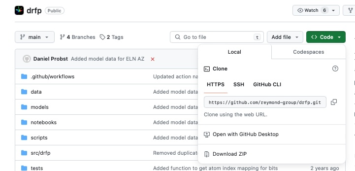

# Week 7: Setup

Welcome to week 7! As always, we first need to update the remote and local repositories to get the new exercises. These are the steps to achieve this:

1. Commit your changes:

    ```bash
    git add .
    git commit -m "Changes to week 6"
    ```

2. Push your changes (this is an example when you are on the main branch):

    ```bash
    git push origin main
    ```

3. Go to the Github website and hit the button that says "Sync to Upstream Repository"
4. Pull the updated repository:

    ```bash
    git pull
    ```

Aaaand that's it! You're ready to start with week 7.

**Happy coding** :star_struck:

# Exercise 1: Python Package installation

## Installing a Python Package (part A)

In this tutorial, we will explore different ways to install a Python package. We will specifically focus on installing the `drfp` (Direct Retrosynthesis-based Fingerprint) package, which was discussed in the lecture. Before we proceed, let's set up a new conda environment with Python 3.10 and JupyterLab to ensure compatibility and isolation.

### Installing from PyPI

PyPI (Python Package Index) is the official repository for Python packages. 


### Creating a New Conda Environment

Open your terminal (or Anaconda Prompt on Windows) and run the following command to create a new conda environment named `drfp_env` with Python 3.10 and JupyterLab:

```
conda create -n drfp_env python=3.10 jupyterlab
```

After the environment is created, activate it using the following command:

```
conda activate drfp_env
```

You can install the `drfp` package from PyPI using the following command:

```
pip install drfp
```

Now, you're ready to install the `drfp` package using one of the following methods.

This command will download the latest stable version of the `drfp` package from PyPI and install it in your current conda environment.

### Testing DRFP from pypi

Now open `jupyter lab`, and run the `exercise_01/07_drfp_partA.ipynb`. This is just a quick test to make sure that `drfp` was properly installed.

## Installing from Source (part B)

In the second part, you can install the `drfp` package directly from the source code hosted on GitHub. This method is useful if you want to work with the latest development version or contribute to the project.

#### Creating a Separate Environment for Source Installation

It's a good practice to create a separate conda environment when installing from source to keep things organized and avoid conflicts with other environments. Let's create a new environment called `drfp_source`:

Open a new terminal or run `conda deactivate`.

```
conda create -n drfp_source python=3.10 jupyterlab
```
Then activate the environment. 
```
conda activate drfp_source
```

1. Clone the GitHub repository by running the address you find on [https://github.com/reymond-group/drfp/](https://github.com/reymond-group/drfp/) under `Code`. One potential folder to place it would be `~/git`, but you can also put it into another folder. The folder has to be created before you can navigate there with `cd`. It should be outside your exercises folder.



```
cd /path/to/your/target_folder
git clone https://github.com/reymond-group/drfp.git
```

2. Navigate to the cloned repository:

```
cd drfp
```

3. Install the package using pip in development mode:

```
pip install -e .
```

The `-e` flag stands for "editable" mode, which allows you to make changes to the source code and have them immediately reflected in your installation without having to reinstall the package. This is not necessary in this case, but typically useful if you want to make changes to the code. You could have also run `pip install .`. 

By installing from source in development mode, you have the flexibility to modify the code or stay up-to-date with the latest changes made to the package.

Remember, it's generally a good practice to create a new conda environment for each project to avoid potential conflicts and maintain a clean working environment.

### Testing DRFP from source

In a terminal, navigate back to the your `week_07` exercise folder using `cd`.

Once you are there:

```
jupyter lab
```

and execute the code cells in `exercise01/07_drfp_partB.ipynb`. 


# Exercise 2: Turn a scripts into Python packages


Just to be safe let's create another conda environment.

```
conda deactivate
conda create -n w7_reactions python=3.10 jupyterlab
```
Activate your new environment. 

```
conda activate w7_reactions
```
And start another jupyterlab in this environment.

```
jupyter lab
```

Follow the instructions in `exercise_02/07_from_script_to_package.ipynb` to learn more about how to build your first package using `pyproject.toml`. Remember that the build tool will only recognize subfolders containing an `__init__.py` file (even if empty) as part of the package. 

Additional information can be found on how to write a `pyproject.toml` file can be found on [https://packaging.python.org/en/latest/guides/writing-pyproject-toml/](https://packaging.python.org/en/latest/guides/writing-pyproject-toml/). Here, we will first just explore the minimal set of metadata. 


# Exercise 3 (optional, advanced): Turn an RXN-insight into a Python package

[Rxn-INSIGHT](https://jcheminf.biomedcentral.com/articles/10.1186/s13321-024-00834-z) provides a lot of valuable information on chemical reactions. Unfortunately, the code is not distributed as a pip installable package. You could import the functionality from the scripts, but making it into a Python package would be much more valuable.

Could you do that? Here some pointers to start with: 

1. Fork the following repository to your GitHub profile [https://github.com/schwallergroup/Rxn-INSIGHT](https://github.com/schwallergroup/Rxn-INSIGHT). 

2. Clone it to your computer (e.g. in `~/git` or any other folder outside the ` folder) using the commands that you have learned so far. Don't follow the installation in the README, but use a separate and new conda environment. 

3. Turn it into a Python package.
   - To do so you should add a `pyproject.toml` file to the root folder.
   - Move the `rxn_insight` into a `src` folder, which you have to create
   - Add an `__init__.py` file in the correct folder.
   - Add a `.gitignore` file to the root folder of the project.
   - and for example, 
   The goal is to be able to `pip install -e .` the code and use the functions. Some challenges might arise because of the json files. 

4. Play around with the functionality of your new package, e.g. start from the `demo.ipynb` notebook. 


